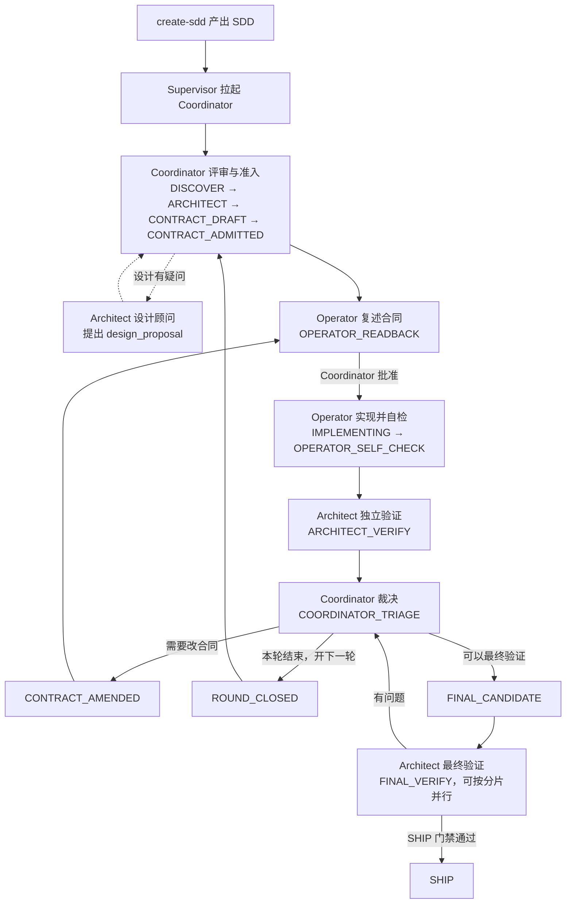

# sdd-loop-delivery 人类说明

给想了解整个交付流程的人看。它解释各角色做什么、阶段怎么流转、失败时怎么收敛，不授予任何权限，也不是 agent 的执行指令；以 [SKILL.md](SKILL.md)、角色文档和控制器状态为准。卡住时的操作步骤见 [runbook](references/runbook.md)。

## 一句话

`create-sdd` 写出设计合同（SDD），`sdd-loop-delivery` 按合同组织一支小团队交付：Coordinator 负责决策，Operator 负责实现，Architect 负责独立验证；控制器记录每一步的授权与证据，最终只在证据完整时 SHIP。

## 角色

| 角色 | 做什么 | 不做什么 |
| --- | --- | --- |
| Supervisor（你调用 skill 的主线程） | 拉起 Coordinator、向你汇报进度、接收暂停/恢复/取消等指令 | 不签发租约、不裁决问题、不选路线 |
| Coordinator（常驻） | 评审与准入设计、派发任务、裁决问题、记录需求状态、最终 SHIP/BLOCKED | 不写产品代码 |
| Operator | 复述合同、实现、用 `test-run` 自检 | 不能验证自己的实现 |
| Architect | 独立验证候选实现；必要时以设计顾问身份提出方案 | 不改产品文件、不指挥 Operator |

Coordinator 通过**租约（lease）**授权 Operator 和 Architect：租约限定范围、期限（Operator 默认 30/60 分钟，Architect 20/40 分钟）和允许的动作。角色的每份成果都是签名事件，写入 `<SDD>.events.jsonl`，状态写入 `<SDD>.loop.json`。

## 使用

```text
$sdd-loop-delivery docs/feature.sdd.md [max_rounds]
```

`max_rounds` 是**逻辑轮数**，默认 5，范围 1–20。每轮最多 6 次"Operator 实现 → Architect 验证"的完整往返；被拒也算一次。复述、改合同、超时、崩溃和流水线故障不消耗次数。

## 完整流程



### 1. 评审与准入

Coordinator 先用 `validate` 检查 SDD 结构，初始化控制器，再独立重建设计逻辑：每个 Must-Ship 需求是否有唯一负责人、可执行的验收、已执行的关键探测、已关闭的授权决策。机械规则由 `validate` 和准入命令拒绝（错误码见 [error-codes](references/error-codes.md)）。

准入先确定共享边界和授权，再关闭当前批次的实施前提；后续批次的实现细节在后续准入处理。本轮才实现的生成器或安装器，可先绑定待执行验收，最终由 Architect 证明实际可用。超过默认测试时间或文件数，需要说明具体验收依据；已批准预算和租约仍限制实际运行。

设计有争议或需要大范围阅读时，Coordinator 派 Architect 以 **design-counsel（设计顾问）**模式参与：Architect 是方案作者，产出 `design_proposal`，Coordinator 决定是否采纳。被采纳为重大修改的方案作者，之后不能验证这个方案的实现。

### 2. Operator 复述合同

准入后 Operator 不直接动手，而是提交 `contract_readback`，复述范围、路线和验收。Coordinator 批准后才进入实现。复述能在写代码前发现理解偏差。

### 3. 实现与自检

Operator 在自己的工作树里实现，所有验收命令都通过 `test-run` 运行：控制器计时、在独立进程组中执行、超时整组杀掉、输出写文件，结果签名记录。测试时间受每个批次的 `test_budget` 约束。自检通过后提交 READY 的 `self_check`，其中候选的四个绑定字段由控制器自动填入。

实现期间，Coordinator 可以让 Architect 提前预读合同、准备环境。只有能提前影响路线的检查才预跑，默认不重复执行完整验收。预跑结果只作参考，正式验证独立实测。

### 4. 独立验证

Architect 在隔离副本上重新运行验收，产出 PASS 或 Finding（问题项，带优先级、复现步骤和修复选项）。每项检查都必须引用本次实测的运行记录；之后若出现同一验收的失败观测，之前的 PASS 失效。

### 5. Coordinator 裁决

验证后一定先回到 Coordinator。它逐条裁决 Finding（按提议修复、改路线、拆分、带约束延期、降级、驳回或请用户决定），然后三选一：

- **改合同**：回到复述，Operator 按新合同继续。
- **结束本轮**：开下一轮，重新起草与准入。
- **进入最终候选**：所有需求就绪，进入最终验证。

同一问题反复失败时有强制收敛规则：被拒一次必须换路线再派；同一根因被拒两次视为规划失败，需要重新准入；连续三次被拒或无进展，必须先做收敛复盘，再继续派发。

### 6. 最终验证与 SHIP

`FINAL_VERIFY` 中 Architect 对全部 Must-Ship 需求和验收做独立最终验证；计划声明了分片时，可由多个 Architect 并行各验一片。

Coordinator 不再单独验收一轮，而是根据 Architect 的证据记录需求状态，再过 SHIP 门禁：

- 当前候选有 Architect 的 PASS，每个需求都有 Architect 证据；
- 没有未关闭的 Finding、待定的用户决策或恢复中的操作；
- 候选工作树没有变化；
- Coordinator 额外核对 SDD 一致性、产物、最终矩阵、改动范围与授权决策。

门禁通过后执行 SHIP。进入 SHIP 或 BLOCKED 时，残留的租约和准备授权会一并撤销；之后只接受宿主资源的收尾记录。

## 失败与停止

- **预算用尽**：轮数或每轮尝试次数用完，不会自动 BLOCKED，而是暂停派发并请你决定。
- **BLOCKED**：只有 Coordinator 提交带枚举原因（如运行环境不可用、无可行安全路线、多轮后仍无法确定等）和证据的 `terminal_blocker` 才会进入。
- **流水线故障**（工具、宿主、网络问题）与产品失败分开计数，不消耗产品预算，也不会变成产品 BLOCKED。
- **暂停、恢复、取消、追加 credit**：通过 `user-control`，需要你的授权；具体命令见 [runbook](references/runbook.md)。
- **Coordinator 失联或不可信**：经你授权后可接管，旧的签名历史保留。

## 结束之后

SHIP 或 BLOCKED 时控制器生成 `<SDD>.retrospective.json`：记录轮数、尝试、测试耗时、问题分布，并按证据给出改进建议（针对 create-sdd、本 skill 或宿主配置）。建议只供人审阅，不会自动修改任何 skill；详见 [evolution](references/evolution.md)。

## 证据与完整性

- 控制器是状态和事件的唯一写入者；每次修改都在锁内、带事务日志地原子提交，中断可恢复。
- 事件日志被状态中的逐行哈希链绑定：删除、重排、插入、篡改都会被发现。每轮结束时记录检查点，轮内命令只校验检查点之后的内容；`audit`、`status` 和 SHIP 校验全部历史。
- 签名证明证据来源，不证明产品正确；正确性只来自独立验证。
